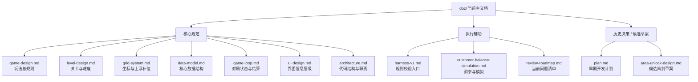

# 📖 文档导航

> `doc/` 是当前项目文档的主目录。  
> `docs_origin/` 仅保留历史策划参考，不再作为当前实现依据。  
> 最后更新: 2026-03-28

---

## 使用原则

1. 先看本文件，再按主题深入。
2. 优先相信 `doc/`，不要把 `docs_origin/` 当成现行规则。
3. 每份文档只回答一个问题，避免重复定义同一规则。
4. 阶段性文档可以保留，但必须标明“是否仍然生效”。

---

## 文档分层



---

## 快速导航

### 核心规范

| 文档 | 用途 | 是否应继续维护 |
|------|------|----------------|
| [game-design.md](./game-design.md) | 定义核心玩法、顾客、道具、胜负条件 | 是 |
| [level-design.md](./level-design.md) | 定义关卡配置字段、难度节奏、配置示例 | 是 |
| [grid-system.md](./grid-system.md) | 定义坐标系、上浮补位、安全生成 | 是 |
| [data-model.md](./data-model.md) | 定义主要类型、状态结构、存档结构 | 是 |
| [game-loop.md](./game-loop.md) | 定义局内流程、状态机、连锁结算 | 是，但建议压缩 |
| [ui-design.md](./ui-design.md) | 定义信息布局、交互反馈、界面层级 | 是，但建议压缩 |
| [architecture.md](./architecture.md) | 定义当前代码结构、模块职责、技术边界 | 是，需要按实际代码校正 |

### 执行辅助

| 文档 | 用途 | 说明 |
|------|------|------|
| [harness-v1.md](./harness-v1.md) | 工程校验入口 | 偏执行说明，不负责定义玩法 |
| [customer-balance-simulation.md](./customer-balance-simulation.md) | 顾客耐心与分布模拟 | 偏调参与分析 |
| [review-roadmap.md](./review-roadmap.md) | 当前问题和优先级 | 偏阶段性决策，定期重写 |

### 历史决策 / 候选草案

| 文档 | 当前定位 | 处理建议 |
|------|----------|----------|
| [plan.md](./plan.md) | 早期开发计划 | 不再作为主导航入口，只在回顾开发阶段时查阅 |
| [area-unlock-design.md](./area-unlock-design.md) | 候选策划草案 | 未进入核心规则前，不应引用为实现依据 |

---

## 推荐阅读路径

### 想理解现在这个游戏怎么运作

1. [game-design.md](./game-design.md)
2. [grid-system.md](./grid-system.md)
3. [game-loop.md](./game-loop.md)
4. [level-design.md](./level-design.md)

### 想改关卡或调数值

1. [level-design.md](./level-design.md)
2. [data-model.md](./data-model.md)
3. [customer-balance-simulation.md](./customer-balance-simulation.md)
4. [harness-v1.md](./harness-v1.md)

### 想对照代码结构排查实现

1. [architecture.md](./architecture.md)
2. [data-model.md](./data-model.md)
3. [review-roadmap.md](./review-roadmap.md)

---

## 当前整理建议

### 立即处理

- `architecture.md` 需要按当前 `src/` 目录重写，删掉不存在的模块和过时渲染描述。
- `game-loop.md` 内容过长，适合拆成“主流程”和“附录状态机/事件表”。
- `ui-design.md` 里有大量静态像素稿描述，建议只保留信息层级、关键尺寸和交互反馈。

### 可延后处理

- `data-model.md` 和 `level-design.md` 有部分字段说明重复，后续应把“字段定义”集中到 `data-model.md`，`level-design.md` 只保留“怎么配”。
- `review-roadmap.md` 适合每个阶段重写，不适合长期累积。
- `plan.md` 可以保留，但不应继续出现在“核心文档”区域。

---

## 文档模板建议

后续主文档统一使用下面四段结构，避免越写越散：

1. 这份文档回答什么问题
2. 当前生效的规则
3. 与其他文档的边界
4. 最后更新日期

推荐正文顺序：

```markdown
# 标题

> 适用范围:
> 关联文档:
> 状态:
> 最后更新:

## 这份文档回答什么问题

## 当前规则

## 文档边界

## 变更记录
```
