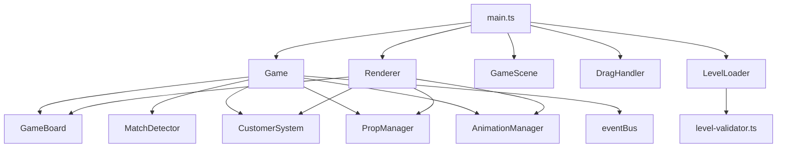
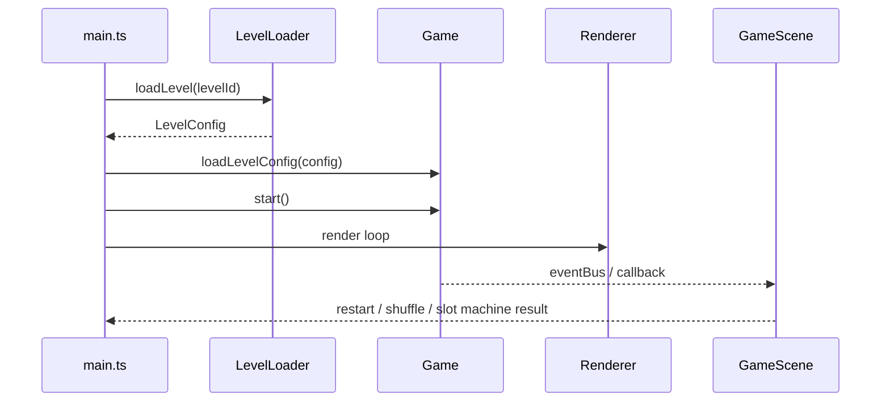

# 🏗️ 技术架构文档

> 适用范围: 当前原型代码结构与模块职责，包括 Vite 原型与 Cocos 迁移工程  
> 关联文档: [game-loop.md](./game-loop.md)、[data-model.md](./data-model.md)、[level-design.md](./level-design.md)  
> 状态: 当前实现基线  
> 最后更新: 2026-04-20

---

## 这份文档回答什么问题

这份文档只回答三个问题：

1. 当前代码是怎么分层的
2. 关键模块分别负责什么
3. 新功能应该加到哪里

它不再描述早期理想化架构，也不再维护与当前代码不一致的“未来模块图”。

---

## 当前技术栈

| 项目 | 当前实现 |
|------|----------|
| 语言 | TypeScript |
| 游戏引擎 | Cocos Creator 3.8.8 |
| 状态组织 | `GameSession` 聚合状态 + 各子系统内部持有状态 |
| 事件通信 | 自研 `eventBus` |
| 存档 | Cocos `Storage` 封装 |
| 关卡资源 | `assets/resources/config/game.json` |

说明：
- 本项目从 Vite 原型迁移至 Cocos Creator，迁移已于 2026-04-26 完成。
- 规则留在纯 TS（`domain/`），Cocos 只负责渲染和交互。
- 没有 Redux / Zustand 一类外部状态库。
- 当前是"轻量模块化原型"，不是严格意义上的 ECS 或分层后端式架构。

---

## 代码结构

### 1. 纯规则层 (domain/)

- 路径：`assets/script/domain/`
- 说明：纯 TypeScript，无 Cocos 依赖，可独立测试

### 2. 会话编排层 (game/session/)

- 路径：`assets/script/game/session/`
- 说明：GameSession 作为应用编排层，暴露快照和事件

### 3. Cocos 视图层 (view/)

- 路径：`assets/script/view/`
- 说明：Cocos 组件，订阅 Session 事件驱动渲染

### 4. Cocos 基础设施层 (infra/)

- 路径：`assets/script/infra/`
- 说明：资源加载、存档、设置等基础设施

### 5. 场景启动层 (bootstrap/)

- 路径：`assets/script/bootstrap/`
- 说明：GameScene 场景入口

当前 Cocos 工程已跑通：

- 关卡和 flavor 资源读取
- 棋盘初始化
- 拖拽交换
- 匹配消除与上浮补位
- 基础 tween 动画
- 顶部 HUD 拆分
- `Loading.scene -> Lobby.scene -> Game.scene` 多场景链路
- 启动 Loading 流程
- 首页 Settings / Tutorial 流程
- 局内 Pause / Restart / Exit 流程
- 最小返回大厅链路
- 关卡总数已由 `resources/config/game.json` 驱动，宿主进度层不再单独硬编码 50 关
- 通关结算已能识别“是否还有下一关”，最后一关不会再继续显示误导性跳转入口
- overlay 根节点已统一支持“prefab 优先 + fallback 动态节点”的装配方式，便于在 Creator 中逐页替换为正式骨架 prefab
- `Lobby.scene` 负责大厅/选关/教程/设置入口，`Game.scene` 只承载局内 HUD、棋盘、结算与暂停流程

当前尚未完全完成：

- 正式 prefab 资源资产化
- 分阶段动画时间线
- Creator 编辑器内的最终视觉收口与资源摆放

---

## 代码结构



当前目录：

```text
src/
  core/
    board.ts
    customer.ts
    flavor-manager.ts
    ingredient.ts
    level-loader.ts
    level-progress.ts
    level-validator.ts
    match-detector.ts
    prop-manager.ts
  render/
    animation-renderer.ts
    renderer.ts
  systems/
    ad-simulator.ts
    animation-manager.ts
    asset-manager.ts
    event-bus.ts
    storage.ts
  ui/
    game-scene.ts
    level-select-screen.ts
    loading-screen.ts
    lobby-screen.ts
    settings-dialog.ts
    tutorial-screen.ts
  input/
    drag-handler.ts
  utils/
    grid.ts
    random.ts
    viewport.ts
  types/
    index.ts
    level.ts
  game.ts
  main.ts
```

---

## 模块职责

### 入口层

| 文件 | 职责 |
|------|------|
| `src/main.ts` | 应用启动、Canvas 创建、主循环、场景切换、关卡加载 |
| `src/game.ts` | 聚合核心玩法，驱动交换、匹配、补位、顾客结算、胜负判断 |

### 核心玩法层

| 文件 | 职责 |
|------|------|
| `src/core/board.ts` | 棋盘数据、填盘、上浮补位、洗牌、生成配置 |
| `src/core/match-detector.ts` | 横竖匹配检测、连通组构建、可移动步检测 |
| `src/core/customer.ts` | 固定顾客池、前台顾客、回合制耐心、服务/离场统计 |
| `src/core/ingredient.ts` | 食材创建、进阶、礼盒判断、口味相关逻辑 |
| `src/core/prop-manager.ts` | 道具库存、消耗、广告补充入口 |
| `src/core/level-loader.ts` | 关卡 JSON 加载与缓存 |
| `src/core/level-validator.ts` | 关卡配置合法性校验 |
| `src/core/level-progress.ts` | 通关进度、解锁、星级记录 |

### 表现与交互层

| 文件 | 职责 |
|------|------|
| `src/render/renderer.ts` | Canvas 主渲染，绘制棋盘、顶部信息、道具按钮 |
| `src/render/animation-renderer.ts` | 动画绘制辅助 |
| `src/ui/game-scene.ts` | 游戏内 DOM 覆盖层，如结算弹窗、提示、老虎机 |
| `src/ui/*screen.ts` | Loading、Lobby、选关等非局内页面 |
| `src/input/drag-handler.ts` | 触控/鼠标拖拽输入，转换为格子交换 |

### 基础设施层

| 文件 | 职责 |
|------|------|
| `src/systems/animation-manager.ts` | 动画生命周期与播放 |
| `src/systems/event-bus.ts` | 模块间发布/订阅通信 |
| `src/systems/storage.ts` | 本地存档读写 |
| `src/systems/asset-manager.ts` | 资源加载 |
| `src/systems/ad-simulator.ts` | 原型期广告模拟 |

### 类型与工具层

| 文件 | 职责 |
|------|------|
| `src/types/index.ts` | 通用游戏类型 |
| `src/types/level.ts` | 关卡配置类型 |
| `src/utils/grid.ts` | 网格坐标与布局工具 |
| `src/utils/random.ts` | 随机工具 |
| `src/utils/viewport.ts` | 视口与布局同步 |

---

## 当前运行流程



关键点：
- `main.ts` 不直接处理玩法规则，只负责把页面、关卡和游戏对象接起来。
- `Game` 是玩法闭环中心。
- `Renderer` 和 `GameScene` 分别处理 Canvas 内表现和 DOM 覆盖层表现。

---

## 当前设计取舍

### 1. `Game` 是中心聚合器

优点：
- 原型阶段改逻辑快
- 交换、连锁、顾客、道具、胜负都能在一个入口串起来

代价：
- `src/game.ts` 已经偏大
- 后续继续加机制时，容易变成“超级类”

当前建议：
- 短期继续保持
- 新功能优先提炼为 `core/*` 或 `systems/*`
- 不要再把更多纯规则细节堆回 `main.ts`

### 2. Canvas 和 DOM Overlay 混合

当前做法：
- 棋盘、道具、顶部局内信息主要走 Canvas
- 弹窗、提示、老虎机等更适合 DOM 的内容走 `GameScene`

优点：
- 原型实现速度快
- 复杂弹窗不必全手绘

代价：
- 需要同步 Canvas 与 Overlay 的位置和尺寸

### 3. 配置驱动已用于关卡，但仍未完全用于玩法

当前已配置化：
- 网格大小
- 顾客参数
- 口味分布
- 初始 / 补位食材分布
- 星级线

当前仍偏代码内规则：
- 对局状态切换
- 连锁处理顺序
- 礼盒自动交付
- 死盘失败逻辑

---

## 新功能应该放哪里

| 新需求 | 推荐位置 |
|--------|----------|
| 新的棋盘规则 | `src/core/board.ts` 或新的 `src/core/*` |
| 新的匹配或合成规则 | `src/core/match-detector.ts` / `src/core/ingredient.ts` |
| 新顾客行为 | `src/core/customer.ts` |
| 新道具 | `src/core/prop-manager.ts` + `src/game.ts` |
| 新弹窗或局内覆盖 UI | `src/ui/game-scene.ts` |
| 新页面 | `src/ui/*screen.ts` |
| 新存档字段 | `src/systems/storage.ts` + `src/core/level-progress.ts` |
| 新关卡字段 | `src/types/level.ts` + `src/core/level-validator.ts` |

---

## 文档边界

这份文档不负责：
- 定义玩法规则细节
- 定义关卡数值
- 定义 UI 视觉稿细节

这些内容分别看：
- 玩法规则: [game-design.md](./game-design.md)
- 对局流程: [game-loop.md](./game-loop.md)
- 关卡配置: [level-design.md](./level-design.md)
- 数据结构: [data-model.md](./data-model.md)

---

## 变更记录

| 日期 | 变更 |
|------|------|
| 2026-03-28 | 按当前 `src/` 代码结构重写，删除与实际实现不一致的早期架构描述 |
