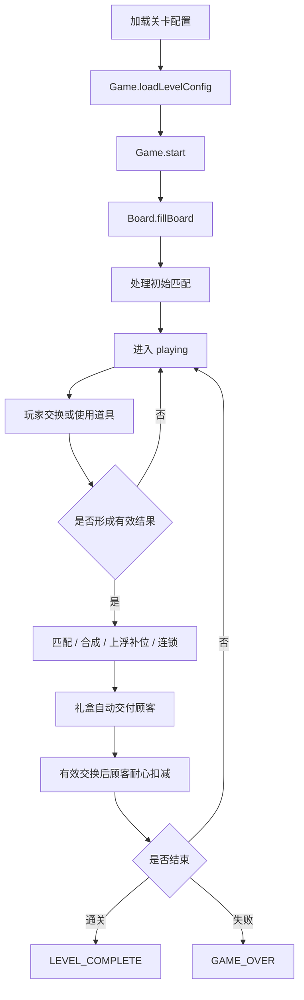
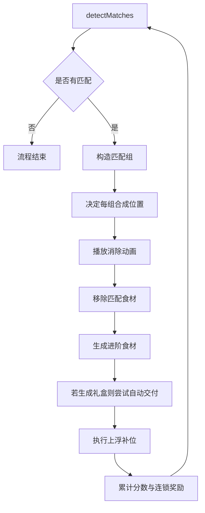

# 🔄 游戏循环文档

> 适用范围: 当前局内主流程、状态切换、结算规则  
> 关联文档: [game-design.md](./game-design.md)、[grid-system.md](./grid-system.md)、[level-design.md](./level-design.md)  
> 状态: 当前实现基线  
> 最后更新: 2026-03-28

---

## 这份文档回答什么问题

这份文档只描述当前版本一局游戏是怎么跑完的：

1. 关卡如何开始
2. 玩家一次有效操作后会发生什么
3. 顾客、礼盒、连锁如何结算
4. 什么时候通关，什么时候失败

它不再维护早期那种大而全的状态机讲解，也不再重复 UI 细节。

---

## 主流程

---

## 关卡启动流程

当前入口在 `src/main.ts`：

1. `LevelLoader` 读取关卡 JSON。
2. `level-validator` 校验配置合法性。
3. `Game.loadLevelConfig()` 将配置注入棋盘、口味分布、顾客系统。
4. `Game.start()` 调用 `board.fillBoard()`。
5. 若初始盘面已有匹配，立刻进入 `processMatches()` 清盘，直到盘面稳定。
6. 进入可操作状态。

说明：
- 当前开局目标不是“必定无连锁”，而是“初始化后进入一个稳定、可继续操作的局面”。
- 棋盘使用上浮补位，不是传统下落补位。

---

## 一次交换的结算顺序

当前有效交换流程在 `src/game.ts` 中由 `handleDragEnd()` 和 `trySwap()` 驱动。

### 无效交换

条件：
- 两格不相邻
- 或交换后没有形成任何匹配

结果：
- 交换动画播放后回退
- 不扣顾客耐心
- 不改变关卡进度

### 有效交换

条件：
- 交换后至少形成一个匹配组

结果顺序：

1. 记录最后一次交换位置，用于决定合成落点。
2. 执行交换。
3. 进入 `processMatches()`。
4. 当前轮全部连锁结算完成后，若仍在 `playing`，执行一次 `customerSystem.consumeTurn()`。
5. 检查通关或失败。

关键规则：
- 顾客耐心只在有效交换后扣减。
- 连锁反应本身不会额外重复扣耐心。

---

## 匹配与连锁流程

当前实现特征：
- 横向和纵向匹配都会先被检测出来。
- 相连的同阶匹配线会合并成一个“匹配组”统一处理。
- 每个独立匹配组只生成一个高一级食材。
- 连锁通过 `while (true)` 循环持续处理，直到盘面无匹配。

---

## 合成落点规则

当前优先级：

1. 如果最后一次交换的 `from` 在匹配组内，用 `from`
2. 否则如果 `to` 在匹配组内，用 `to`
3. 否则使用该匹配组排序后的中心位置

这样做的目的：
- 玩家更容易理解“是我刚拖过去的位置触发了升级”
- 多组同时结算时，仍能得到稳定的落点

---

## 口味结算规则

当匹配组形成高阶食材时，口味按下面顺序决定：

1. 组内全是同一种口味，则直接继承该口味。
2. 若某一种口味数量严格更多，则继承多数口味。
3. 若正好是三消且三种口味各 1 个，则触发老虎机决定口味。
4. 其他平局情况，回退到合成源食材的口味。

这部分是当前玩法复杂度较高的来源之一，应尽量保持文档与 UI 说明一致。

---

## 礼盒与顾客结算

### 礼盒生成

当食材升级到礼盒：
- 若前台有对应口味顾客，立即自动交付
- 若没有对应顾客，礼盒保留在棋盘上

### 顾客系统

当前顾客系统不是实时无限刷新，而是固定顾客池：

- 每关有 `totalCount`
- 前台最多同时显示 3 位顾客
- 后续顾客在前台有空位时补入
- 新入场顾客可带 `entryGraceTurns`

### 耐心结算

`customerSystem.consumeTurn()` 的规则：

- 只在有效交换后执行一次
- 有免扣回合的顾客优先消耗免扣次数
- 其余前台顾客耐心 `-1`
- 耐心归零的顾客离场，计入 `missedCustomers`

---

## 胜负判断

### 通关

当前通关条件：

- `remainingCustomersToServe <= 0`

也就是：
- 所有顾客都已经被服务完成或离场结算完毕
- 系统触发 `LEVEL_COMPLETE`
- 结算时带出 `score / stars / servedCustomers / missedCustomers`

### 失败

当前主失败条件：

- 棋盘已满
- 且 `findPossibleMoves()` 返回 0
- 且关卡尚未完成

也就是常说的“死盘失败”。

当前没有把 `moveLimit` 作为主失败条件。

---

## 状态定义

当前 `GamePhase` 主要围绕以下状态运行：

| 状态 | 含义 |
|------|------|
| `menu` | 初始或未进入局内 |
| `playing` | 正常可操作 |
| `paused` | 暂停，不继续处理连锁 |
| `levelComplete` | 已通关 |
| `gameOver` | 已失败 |

说明：
- `paused` 期间，`processMatches()` 会提前停止。
- `resume()` 后会调用 `continueProcessing()`，补完未处理完的匹配。

---

## 事件输出

当前关键事件：

| 事件 | 作用 |
|------|------|
| `INGREDIENT_SWAPPED` | 交换完成，供表现层响应 |
| `MATCH_FOUND` | 找到匹配，供动画和反馈使用 |
| `INGREDIENT_MERGED` | 生成进阶食材 |
| `CUSTOMER_SERVED` | 顾客被成功服务 |
| `LEVEL_COMPLETE` | 通关结算 |
| `GAME_OVER` | 失败结算 |

原则：
- 事件总线负责“广播发生了什么”
- 真正的规则结算仍应留在 `Game` 和 `core/*` 中

---

## 文档边界

这份文档不负责：
- 定义所有关卡字段
- 解释所有 UI 尺寸和视觉稿
- 解释上浮补位的底层实现细节

相关文档：
- 关卡配置: [level-design.md](./level-design.md)
- 上浮补位细节: [grid-system.md](./grid-system.md)
- 总玩法规则: [game-design.md](./game-design.md)

---

## 变更记录

| 日期 | 变更 |
|------|------|
| 2026-03-28 | 按当前 `Game` 实现重写，聚焦真实局内闭环，删除过长的早期状态机说明 |
