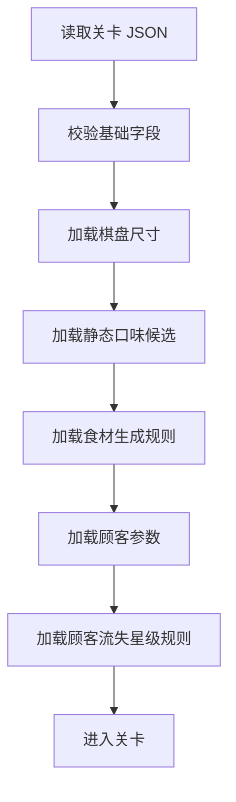

# 关卡设计

> 文档状态：候选草案
>
> 说明：本文记录本轮确认后的关卡改版方案，用于后续重构 `doc/` 与代码。
> 当前内容与现行实现存在明确冲突，不能直接视为当前正式规则。
> 正式依据仍以 `src/` 实现和 `doc/` 目录为准，待后续同步更新。

---

## 一、本轮已确认的改版结论

1. 关卡内仍按顺序解锁，区域解锁单独计算，不混入单关 `unlockCondition`。
2. 口味不再主导整盘分布，而是作为少量标签层存在。
3. 全盘带任意非原味标签的总占比，目标维持在约 `5% ~ 10%`。
4. 该占比主要通过新生成食材的带味数量控制，而不是放大初始盘面口味覆盖率。
5. 单局口味组合仍按“原味 + 当前区域专属口味 + 已解锁口味中随机 1 种”的设计规则理解，但配置层先按静态方式表达。
6. 不再有基于分数阈值的星级目标。
7. 星只用于顾客流失判定：
   - `0` 流失 = `3` 星
   - `1` 流失 = `2` 星
   - `2` 流失 = `1` 星
   - `3` 及以上流失 = 失败
8. 教学关概念弱化，只保留普通关卡，不再在关卡配置中单独放教学步骤。
9. `presetBoard` 仅保留给调试关。
10. `difficultyScaling` 暂不定稿，本轮只保留“待讨论”状态。

---

## 二、与当前实现的冲突说明

当前代码与现行文档中，仍然存在以下旧规则：

- `unlockCondition` 仍按前置关卡 `prevLevel` 校验。
- `starRatings` 仍作为分数阈值存在。
- `tutorial` 仍是关卡字段，且当前校验里 `levelId = 1` 必须启用。
- `difficultyScaling` 仍是已定义字段。
- `presetBoard` 当前仍是通用可选字段，只是实际主要用于调试关。
- 口味分布仍以整盘权重配置为主，而不是“低占比标签层”。

因此，本文只能作为后续改造输入，不能当作“当前实现说明”使用。

---

## 三、关卡配置设计目标

### 1. 关卡层与区域层分离

后续需要明确分成两层：

- 关卡层：描述单关内部的棋盘、生成、顾客、失败判定等。
- 区域层：描述区域解锁成本、区域专属口味、循环关、区域进度等。

本文件只讨论关卡层。

区域层规则参考：

- `docs_origin/吐司面包店区域与口味解锁策划方案.md`

### 2. 口味是稀疏标签，不是主分布

后续设计中，食材主体仍以通用食材链为核心：

```text
1阶: 小麦 → 2阶: 面粉 → 3阶: 面团 → 4阶: 面包坯 → 5阶: 吐司 → 6阶: 礼盒
```

口味不是另一套独立主棋盘，而是附着在少量食材上的标签属性：

- 原味仍是默认基础口味。
- 非原味标签总量应始终较低。
- 目标是让玩家能感知“口味差异”，但不让盘面被口味复杂度淹没。

### 3. 星级从“结算奖励”改为“容错判定”

星不再来自得分阈值，而来自顾客流失数量。

它的职责变为：

- 反馈本局服务质量。
- 决定是否失败。
- 为后续进度评价保留简洁指标。

它不再承担：

- 分数档位目标。
- 单关三星刷分目标。

---

## 四、建议中的关卡结构

## 1. 结构草图

```text
LevelConfig
├── levelId
├── levelName
├── description
├── unlockCondition
├── difficulty
├── gridSize
├── presetBoard?           // 仅调试关允许
├── flavors
├── ingredientSpawn
├── customers
├── starPolicy
├── debug?                 // 调试关可用
└── difficultyScaling?     // 待讨论
```

说明：

- `starRatings` 计划改为 `starPolicy` 一类的“流失规则定义”。
- `tutorial` 计划移出关卡配置。
- `presetBoard` 虽仍是可选字段，但设计上只服务调试关。

### 2. 建议读取流程



---

## 五、字段设计说明

### 1. 基础信息

| 字段 | 类型 | 说明 |
|------|------|------|
| `levelId` | `number` | 关卡 ID，必须和文件编号一致 |
| `levelName` | `string` | 关卡显示名称 |
| `description` | `string` | 关卡描述文案 |
| `difficulty` | `string` | 难度标记，后续建议只保留普通难度分层，不再使用 `tutorial` 类型 |

说明：

- 教学引导如果还需要，应转移到局外引导系统或独立引导流程。
- 正式关卡配置里不再附带教学步骤。

### 2. 解锁条件 `unlockCondition`

建议仍保留：

```json
"unlockCondition": {
  "prevLevel": 9
}
```

规则：

- 单关内部仍按顺序解锁。
- `levelId = 10` 时，`prevLevel = 9`。
- `level-000` 为调试关，`prevLevel = 0`。

明确排除：

- 区域解锁成本
- 区域是否已开放
- 区域循环关逻辑

这些不属于单关 `unlockCondition`，应放在区域或大地图配置中。

### 3. 棋盘尺寸 `gridSize`

```json
"gridSize": {
  "rows": 6,
  "cols": 6
}
```

当前提案不改这部分大方向：

- 维持正方形棋盘。
- 常用范围仍可按 `5x5` 到 `7x7` 理解。

但“教学关专用小棋盘”不再作为结构设计前提。

### 4. 固定盘面 `presetBoard`

```json
"presetBoard": [
  [
    { "type": "toast", "flavor": "matcha" },
    { "type": "dough", "flavor": "original" }
  ]
]
```

保留原则：

- 只给调试关使用。
- 正式关不依赖固定盘面做玩法设计。
- 若存在该字段，数组尺寸必须与 `gridSize` 一致。

这意味着后续若出现正式关卡配置了 `presetBoard`，应视为特例或临时测试手段，而不是常规设计能力。

---

## 六、口味系统设计

### 1. 单局口味组合规则

设计目标沿用区域策划文档中的逻辑：

- 每局固定 3 种可制作口味。
- 必出原味。
- 必出当前区域专属口味。
- 再从玩家已解锁的其他口味中随机抽取 1 种。

但在关卡配置层，现阶段仍按静态配置表达，不直接把“随机抽取过程”写进单关 JSON。

也就是说：

- 设计规则是动态的。
- 配置表达先是静态的。

### 2. `flavors` 的建议职责

```json
"flavors": {
  "available": ["original", "matcha", "strawberry"]
}
```

后续建议把 `flavors` 的职责收缩为：

- 描述本局允许参与的口味集合。
- 不再把它理解成“整盘口味大权重配置入口”。

建议弱化甚至移除的旧语义：

- `distribution` 代表整盘初始口味占比
- `refillBias` 代表整盘补位口味占比

原因：

- 非原味口味不该再占据整盘显著比例。
- 口味设计的重点已变成“低占比标签控制”。

### 3. 非原味标签占比目标

本轮已确认：

- 全盘带任意非原味标签的总占比，目标维持在约 `5% ~ 10%`。

这里的口径是：

- 统计整盘所有食材。
- 只要食材口味不是 `original`，都计入分子。
- 不区分是区域专属口味还是额外抽中的第三口味。

示例：

- `7x7` 棋盘共 `49` 格。
- 非原味标签建议常驻约 `2 ~ 5` 格。

### 4. 占比控制方式

核心控制方式不是让初始盘面直接铺满口味，而是：

- 初始盘面保持低密度口味标签。
- 补位生成时优先控制“是否生成带非原味标签的食材”。
- 当盘面非原味占比偏低时，适度补充。
- 当盘面非原味占比接近上限时，降低继续补充概率。

目标：

- 把盘面稳定在 `5% ~ 10%` 附近。
- 避免口味过少导致无感。
- 避免口味过多导致失衡和认知负担。

### 5. 生成配置 `ingredientSpawn`

现阶段可继续保留：

```json
"ingredientSpawn": {
  "initial": {
    "tierWeights": [40, 30, 20, 8, 2]
  },
  "refill": {
    "tierWeights": [40, 30, 20, 8, 2]
  }
}
```

建议理解为：

- `tierWeights` 继续负责阶数分布。
- 口味标签生成逻辑后续应从这里拆开，单独表达“带味率控制”。

也就是说，旧的：

- `initial.flavorDistribution`
- `refill.flavorDistribution`

后续都不适合再直接等价为“整盘口味权重”。

它们若继续保留，也应转义为更贴近“标签生成倾向”的参数，而不是覆盖全盘的分布定义。

---

## 七、顾客配置 `customers`

```json
"customers": {
  "totalCount": 3,
  "basePatience": 12,
  "queuePatienceOffset": 9,
  "entryGraceTurns": 2,
  "demandCountRange": [1, 2],
  "allowedFlavors": ["original", "matcha", "strawberry"]
}
```

字段职责暂不做大改：

| 字段 | 说明 |
|------|------|
| `totalCount` | 本关顾客总数 |
| `basePatience` | 第 1 位顾客的基础耐心 |
| `queuePatienceOffset` | 后排顾客额外耐心增量 |
| `entryGraceTurns` | 新上场顾客免扣回合数 |
| `demandCountRange` | 单顾客订单数量范围 |
| `allowedFlavors` | 本关顾客允许索取的口味 |

补充理解：

- `allowedFlavors` 在配置上仍是静态列表。
- 设计上应与本局 3 种可制作口味一致。
- 顾客不应索取本局未开放的口味。

耐心计算仍可沿用：

```text
初始耐心 = basePatience + queuePatienceOffset × queueIndex
```

---

## 八、星级与失败规则

### 1. 分数阈值星级取消

以下旧结构计划废弃：

```json
"starRatings": {
  "oneStar": 1800,
  "twoStars": 3600,
  "threeStars": 5400
}
```

废弃原因：

- 星不再反映分数档位。
- 关卡不再围绕刷分三星来设计。

### 2. 新星级逻辑

建议改为“顾客流失映射规则”：

```text
0 流失 = 3 星
1 流失 = 2 星
2 流失 = 1 星
3 及以上流失 = 失败
```

这里的“流失”指：

- 顾客在未完成订单前，因耐心耗尽离场。

### 3. 建议中的表达方式

后续结构上可考虑改为：

```json
"starPolicy": {
  "lose0": 3,
  "lose1": 2,
  "lose2": 1,
  "failAtLostCustomers": 3
}
```

这只是当前建议命名，字段名后续还可以再统一。

关键是语义要变成：

- 星来自顾客流失数。
- 失败阈值也在同一套规则中描述。

---

## 九、附加字段策略

### 1. 教学配置 `tutorial`

当前结论：

- 从关卡配置中去掉。
- 不再要求某一关必须显式配置教学步骤。
- 后续如保留引导，应从系统层独立设计。

因此，下面这类结构不再作为新版关卡设计的一部分：

```json
"tutorial": {
  "enabled": true,
  "steps": [
    "拖动相邻食材交换位置"
  ]
}
```

### 2. 调试配置 `debug`

仍可保留给调试关：

```json
"debug": {
  "trackProgress": false,
  "hidden": true
}
```

设计意图不变：

- 调试关不计入正式进度。
- 调试关可隐藏。

### 3. 难度缩放 `difficultyScaling`

当前状态：待讨论

本轮只确认两点：

- 先不从设计中正式删除。
- 也不把现有字段定义当成已定稿方案。

后续需要单独讨论的问题包括：

- 它到底服务“生成安全性”还是“体感难度”。
- 它是给程序调优用，还是给策划显式配置用。
- 它是否应该拆成更具体、更好理解的字段。

在结论明确前，不建议继续扩写这部分规则。

---

## 十、建议中的配置示例

下面示例仅用于表达设计方向，不代表当前代码已支持：

```json
{
  "levelId": 12,
  "levelName": "抹茶订单增加",
  "description": "顾客开始稳定索取区域专属口味。",
  "unlockCondition": {
    "prevLevel": 11
  },
  "difficulty": "normal",
  "gridSize": {
    "rows": 6,
    "cols": 6
  },
  "flavors": {
    "available": ["original", "matcha", "strawberry"]
  },
  "ingredientSpawn": {
    "initial": {
      "tierWeights": [38, 30, 20, 10, 2]
    },
    "refill": {
      "tierWeights": [40, 30, 20, 8, 2]
    }
  },
  "customers": {
    "totalCount": 3,
    "basePatience": 12,
    "queuePatienceOffset": 9,
    "entryGraceTurns": 2,
    "demandCountRange": [1, 2],
    "allowedFlavors": ["original", "matcha", "strawberry"]
  },
  "starPolicy": {
    "lose0": 3,
    "lose1": 2,
    "lose2": 1,
    "failAtLostCustomers": 3
  }
}
```

---

## 十一、后续落地建议

按顺序建议这样推进：

1. 先把 `doc/level-design.md` 改成与本文一致的现行目标说明，并明确状态标签。
2. 再调整 `src/types/level.ts`，移除或替换 `starRatings`、`tutorial` 等旧字段。
3. 重写关卡校验器，使其支持新的失败判定与字段约束。
4. 最后再批量迁移 `public/assets/levels/*.json`。

---

## 十二、待继续讨论的问题

1. `starPolicy` 是否保留在每关中配置，还是做成全局统一规则。
2. 口味低占比控制参数最终放在 `flavors` 下，还是放在 `ingredientSpawn` 下。
3. 第三口味的随机抽取是在“开局前由区域系统决定”，还是“读关卡时直接确定”。
4. `difficulty` 的最终枚举值是否需要重新命名和收缩。
5. `difficultyScaling` 是否保留，以及保留成什么形式。

---

*最后更新: 2026-03-29*
