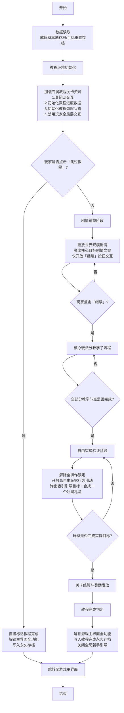
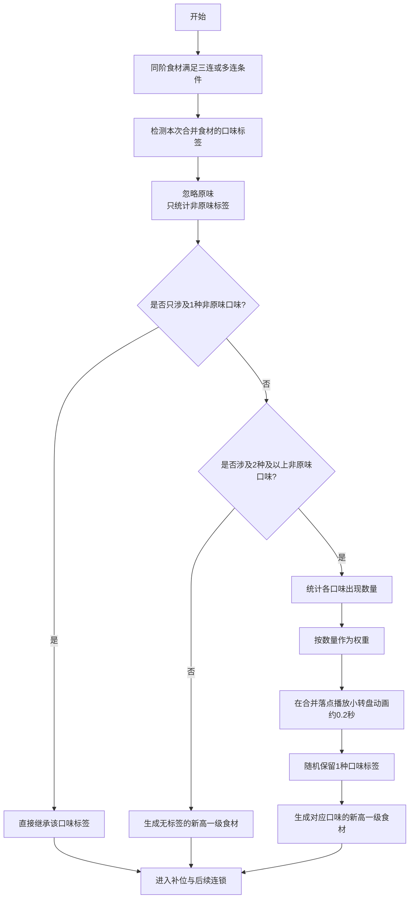
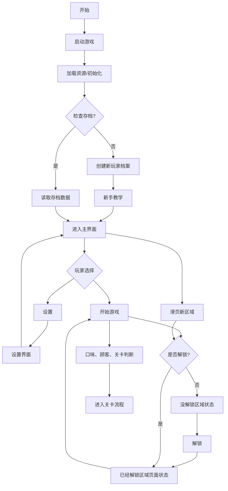
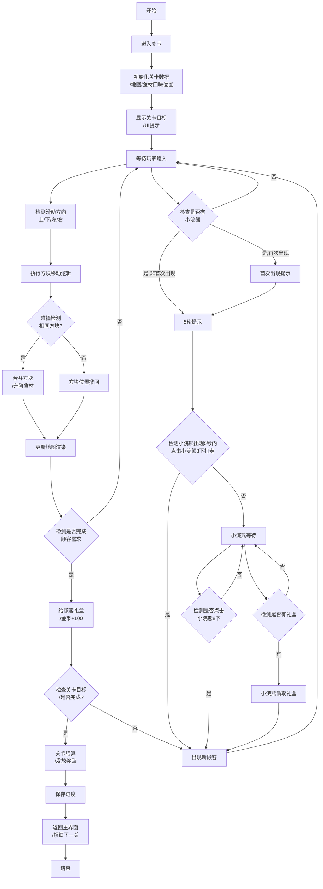

以下是将四张流程图转换为 **Mermaid** 语法的代码块，可直接在支持 Mermaid 的平台（如 Typora、Notion、GitHub 等）渲染展示，还原原流程图的逻辑流程：

### 1. 新手教程流程图

```mermaid
flowchart TD
    A[开始] --> B[数据读取<br>解玩家本地存档/手机重置存档]
    B --> C[教程环境初始化]
    C --> D[加载专属教程关卡资源<br>1.关闭UI交互<br>2.初始化教程进度数据<br>3.初始化教程弹窗状态<br>4.禁用玩家全局层交互]
    D --> E{玩家是否点击「跳过教程」?}
    E -- 是 --> F[直接标记教程完成<br>解锁主界面全功能<br>写入永久存档]
    F --> G[跳转至游戏主界面]
    G --> H[结束]
    E -- 否 --> I[剧情铺垫阶段]
    I --> J[播放世界规模剧情<br>弹出核心目标剧情文案<br>仅开放「继续」按钮交互]
    J --> K{玩家点击「继续」?}
    K -- 否 --> J
    K -- 是 --> L[核心玩法分教学子流程]
    L --> M{全部分教学节点是否完成?}
    M -- 否 --> L
    M -- 是 --> N[自由实操验证阶段]
    N --> O[解除全操作锁定<br>开放高自由玩家行为滑动<br>弹出吸引引导目标：合成一个吐司礼盒]
    O --> P{玩家是否完成实操目标?}
    P -- 否 --> N
    P -- 是 --> Q[关卡结算与奖励发放]
    Q --> R[教程完成判定]
    R --> S[解锁游戏主界面全功能<br>写入教程完成永久存档<br>关闭全局新手引导]
    S --> G
```

### 2. 食材合成口味标签流程

```mermaid
flowchart TD
    A[开始] --> B[同阶食材满足三连或多连条件]
    B --> C[检测本次合并食材的口味标签]
    C --> D[忽略原味<br/>只统计非原味标签]
    D --> E{是否只涉及1种非原味口味?}
    E -- 是 --> F[直接继承该口味标签]
    E -- 否 --> G{是否涉及2种及以上非原味口味?}
    G -- 否 --> H[生成无标签的新高一级食材]
    G -- 是 --> I[统计各口味出现数量]
    I --> J[按数量作为权重]
    J --> K[在合并落点播放小转盘动画<br/>约0.2秒]
    K --> L[随机保留1种口味标签]
    L --> M[生成对应口味的新高一级食材]
    F --> N[进入补位与后续连锁]
    H --> N
    M --> N
```

### 3. 基础流程（游戏启动）

```mermaid
flowchart TD
    A[开始] --> B[启动游戏]
    B --> C[加载资源/初始化]
    C --> D{检查存档?}
    D -- 否 --> E[创建新玩家档案]
    E --> F[新手教学]
    F --> G[进入主界面]
    D -- 是 --> H[读取存档数据]
    H --> G
    G --> I{玩家选择}
    I --> J[设置] --> K[设置界面] --> G
    I --> L[开始游戏]
    L --> M{是否解锁?}
    M -- 否 --> N[没解锁区域状态] --> O[解锁] --> P[已经解锁区域页面状态] --> L
    M -- 是 --> P
    L --> Q[口味、顾客、关卡判断] --> R[进入关卡流程]
    G --> S[滑页新区域] --> M
```

### 4. 合成和小浣熊的逻辑

```mermaid
flowchart TD
    A[开始] --> B[进入关卡]
    B --> C[初始化关卡数据\n/地图/食材口味位置]
    C --> D[显示关卡目标\n/UI提示]
    D --> E[等待玩家输入]

    %% 核心合成玩法主流程
    E --> F[检测滑动方向\n上/下/左/右]
    F --> G[执行方块移动逻辑]
    G --> H{碰撞检测\n相同方块?}
    H -->|是| I[合并方块\n/升阶食材]
    H -->|否| J[方块位置撤回]
    I --> K[更新地图渲染]
    J --> K
    K --> L{检测是否完成\n顾客需求}
    L -->|否| E
    L -->|是| M[给顾客礼盒\n/金币+100]
    M --> N{检查关卡目标\n/是否完成?}
    N -->|是| O[关卡结算\n/发放奖励]
    O --> P[保存进度]
    P --> Q[返回主界面\n/解锁下一关]
    Q --> R[结束]
    N -->|否| S[出现新顾客]
    S --> E

    %% 小浣熊事件分支流程
    E --> T{检查是否有\n小浣熊}
    T -->|否| E
    T -->|是,首次出现| U[首次出现提示]
    T -->|是,非首次出现| V[5秒提示]
    U --> V
    V --> W{检测小浣熊出现5秒内\n点击小浣熊8下打走}
    W -->|是| S
    W -->|否| X[小浣熊等待]

    %% 小浣熊等待阶段的并行检测
    X --> Y{检测是否点击\n小浣熊8下}
    Y -->|是| S
    Y -->|否| X
    X --> Z{检测是否有礼盒}
    Z -->|否| X
    Z -->|有| AA[小浣熊偷取礼盒]
    AA --> S
```
