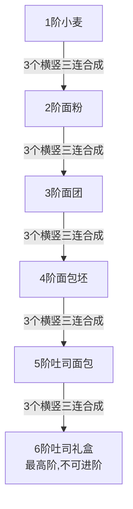
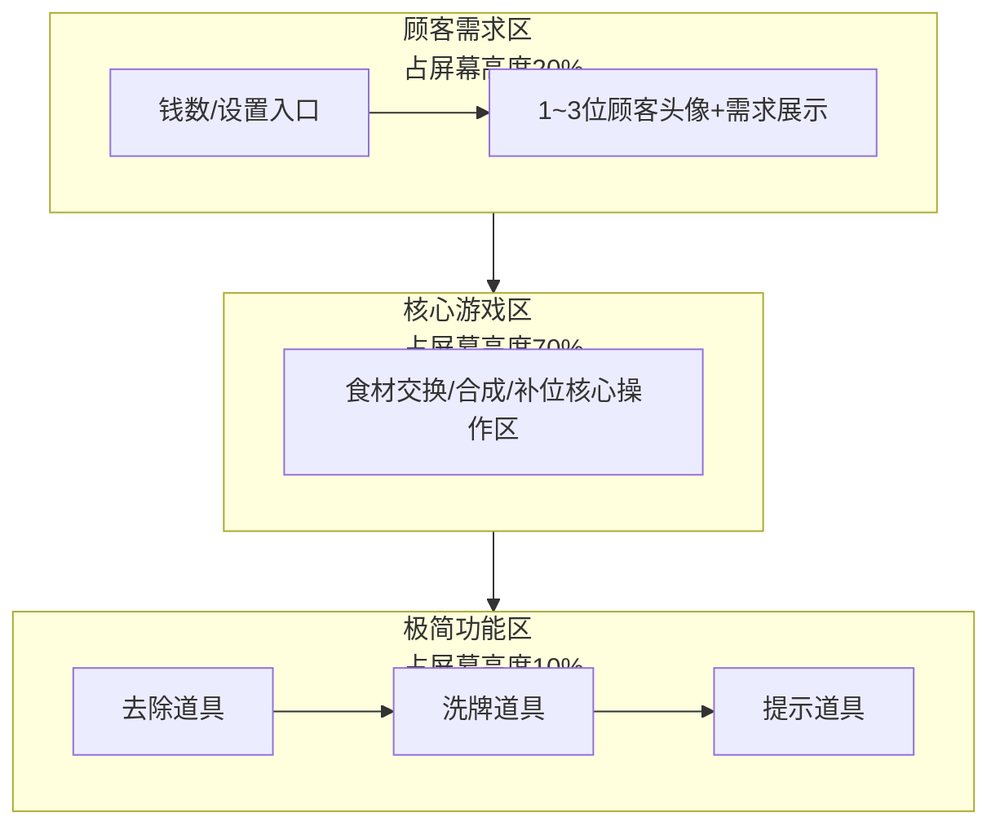
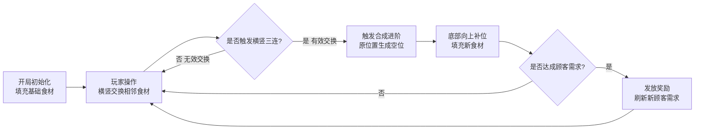

# 《吐司面包店》策划案

> ⚠️ 历史策划草案，仅保留原始思路参考。
> 当前实现与后续开发请优先参考 `doc/` 目录下的正式文档，不要直接以本文作为实现依据。

## 一、游戏基础信息
1.  游戏名称：吐司面包店（暖心烘焙消除）
2.  核心定位：休闲竖版三消+轻度烘焙经营类小游戏，核心玩法参考《滑动海洋》的横竖三连消除、元素进阶、上浮补位核心逻辑，主打「轻松合成+满足顾客需求」的治愈体验，无重度肝度，适合碎片化游玩。
3.  核心受众：休闲小游戏玩家、消除类游戏爱好者、喜欢治愈系烘焙题材的轻量级玩家（全年龄段友好）
4.  核心核心：烘焙进阶+横竖三连消除，经营面包店满足顾客需求

## 二、游戏核心世界观&主题
玩家将扮演一名新晋面包店店长，通过合成烘焙食材的方式制作吐司及礼盒，满足到店顾客的不同需求，从新手店长慢慢经营成人气面包店。整体游戏氛围温馨、治愈、轻松，无失败惩罚，核心乐趣在于「食材合成的成就感」+「满足需求的经营获得感」。

## 三、核心玩法总则
1.  核心操作：玩家可对游戏区内横竖相邻的任意两个食材进行位置互换，仅支持横向/纵向相邻交换，禁止斜向交换，单次交换无冷却、如没有三连就返回原状。
2.  消除合成规则：同品质的食材，满足「横向3个连成一线」或「纵向3个连成一线」（三连）即可触发合成，无斜向三连判定，合成后直接进阶为更高一级的烘焙食材；三连数量≥3也可触发（如4连、5连），合成效果一致，仅额外加分。
3.  补位规则：食材被合成消除后产生的空位，所有新食材均从游戏区最底部向上填充、依次补位，上方食材保持原位，直到填满所有空位，这是核心核心规则，与《滑动海洋》的补位逻辑完全一致。
4.  格子上限：游戏区为固定7×7正方形格子布局（7行7列，共49格），为最大上限，初期从教学关：3✖️2，3✖️3，4✖️4，5✖️5，第二关6✖️6，第三关7✖️7，适配手机竖屏显示，操作手感最佳。
5.  核心目标：合成最高阶食材「吐司礼盒」，并满足屏幕上方的顾客需求，完成订单即可获得游戏奖励、过关，推进游戏节奏。

## 四、核心：6阶烘焙食材进阶链
所有食材的合成、进阶均遵循固定单向6阶链，无反向降级、无随机变异，进阶逻辑简单清晰，是整个游戏的核心骨架，严格按照指定的阶数设计，每一级都必须通过「同阶食材横竖三连」合成升级：

- ✅ 1阶：小麦（基础初始食材，游戏开局主要填充的食材）
- ✅ 2阶：面粉（3个小麦 横竖三连 → 合成1个面粉）
- ✅ 3阶：面团（3个面粉 横竖三连 → 合成1个面团）
- ✅ 4阶：面包坯（3个面团 横竖三连 → 合成1个面包坯）
- ✅ 5阶：吐司面包（3个面包坯 横竖三连 → 合成1个吐司面包）
- ✅ 6阶：吐司礼盒（3个吐司面包 横竖三连 → 合成1个吐司礼盒，最高阶，无更高进阶）

### 高阶食材特殊规则
- 吐司礼盒为游戏最终成品，无法继续合成/进阶，交付给顾客后消失；

## 五、游戏界面分区设计
游戏界面为竖版全屏布局，无复杂弹窗遮挡核心操作区，所有功能区划分清晰，视觉层级明确，总分为三大区域，核心占比与位置完全按要求设定：

### ✅ 顶部区域【顾客需求区】（占屏幕高度20%）
1.  位置：屏幕最上方，横向通栏展示，无遮挡；
2.  钱数，设置（重新开始、退出、音量调节）
3.  内容：显示1~3位卡通顾客的头像+明确的礼盒需求数量（例：「需要1个吐司礼盒」「需要2个吐司礼盒」）；

### ✅ 中间区域【核心游戏区】（占屏幕高度70%，核心操作区）
1.  位置：屏幕正中央，视觉核心区域，无任何遮挡；
2.  内容：固定7×7的正方形格子矩阵，填充所有烘焙食材（小麦、面粉、面团等），食材为卡通Q版风格，同阶食材视觉统一，不同阶食材颜色/造型区分明显，便于玩家快速识别；
3.  交互逻辑：玩家所有的「相邻交换操作」「三连合成操作」均在此区域完成，食材的上浮补位、进阶动画也都在此区域展示；
4.  细节：格子有轻微的烘焙木纹边框，贴合面包店主题，无多余装饰，保证操作视野清晰。

### ✅ 底部区域【极简功能区】（占屏幕高度10%，可选轻量化设计）
无复杂功能，仅保留「去除」「洗牌」「提示」三个助力过关的三连道具按钮，不占用核心操作视野，保证游戏的休闲轻量化属性。各道具具体说明如下：
- 【去除道具】：点击使用后可选择游戏区内任意1个食材将其移除，移除后空位按常规补位规则从底部填充食材；适用于移除阻碍三连合成的孤立食材，每次使用看广告。
- 【洗牌道具】：点击使用后可随机刷新游戏区内所有食材的位置，刷新后不会改变食材的种类和数量，仅重置排列顺序；适用于无有效交换思路时重新寻找三连机会，每次使用看广告。
- 【提示道具】：使用后提示磁力效果，帮助快速找到可凑成的横竖三连，每次使用看广告。

## 六、核心操作与判定规则
### 1. 玩家操作规则（唯一可操作行为）
- 玩家仅能执行「横竖相邻食材互换位置」这一种操作，点击任意一个食材，再点击其「左边/右边/上边/下边」相邻的食材，即可完成位置互换；
- 交换有效性判定：如果交换后，两个食材的位置变化没有触发任何一组横竖三连，则本次交换视为「无效交换」，食材会自动回到原位置，无任何惩罚（无步数扣除、无时间惩罚）；如果交换后触发三连，则为「有效交换」，立即触发合成+进阶+补位的连锁反应。

### 2. 三连合成判定规则
- 触发条件：同阶食材、数量≥3、横竖成线，缺一不可；
- 示例：3个小麦横向排成一行 ✅ 合成面粉；4个面团纵向排成一列 ✅ 合成面包坯；5个吐司面包横向连线 ✅ 合成吐司礼盒；
- 连锁合成：一次交换触发多组三连（例：合成面粉后，上浮补位再次形成面粉三连），会连续触发合成动画，无次数限制，是游戏的核心爽点。

### 3. 食材补位规则
- 触发时机：当食材被合成进阶后，原位置会形成「空位」；
- 补位方式：所有新的食材，均从游戏区的「最底部」向上生成并填充空位，底部优先填满，再依次向上补位，上方的食材不会主动下落，仅会因下方空位被填充而保持原位；
- 补位内容：补位的食材以「1阶小麦、2阶面粉」为主，高阶食材（面团及以上）不会通过补位生成，只能靠合成获得，保证游戏节奏平衡。

## 七、游戏核心流程（闭环，轻松无压力，休闲核心）
游戏为「无限循环+阶段性目标」的休闲模式，无通关失败设定，玩家可随时暂停/退出，核心流程简洁流畅，单局节奏快（3~5分钟），适合碎片化游玩，流程如下：
1.  开局初始化 → 3✖️2游戏区自动填充满1阶小麦+2阶面粉；
2.  玩家操作 → 横竖交换相邻食材，尝试凑出同阶三连；
3.  触发合成 → 三连成功，食材进阶为下一级，原位置留空；
4.  底部补位 → 空位从游戏区最底部向上填充新食材（以小麦为主）；
5.  需求达成 → 合成对应礼盒，完成顶部顾客的礼盒需求；
6.  奖励发放 → 完成需求后获得金币奖励，随即刷新新的顾客需求（难度小幅提升）；
7.  循环往复 → 玩家持续合成进阶，完成更多订单

## 八、奖励机制、成就机制与格子扩容规则
### 1. 奖励机制
奖励发放以“关卡推进+需求完成+成就解锁”为核心，无氪金设定，所有奖励均可通过游戏内正常游玩获取，激励玩家持续推进游戏进度，具体分为三类：
- 【过关解锁奖励】：与格子扩容直接挂钩，从5×5扩容至6×6，扩容至7×7（最终格子）时，解锁专属“扩容大师”头像框。
- 【成就达成奖励】：达成对应成就后发放专属奖励，以荣誉标识和实用道具为主。例如解锁“烘焙达人”成就奖励定制食材皮肤，达成“连消大师”成就奖励对应道具。

### 2. 成就机制
成就体系围绕"面包店成长、核心玩法挑战、收集目标"三大维度设计，成就解锁后永久展示在成就面板，满足玩家收集欲和荣誉感，具体分类及示例如下：
- 【成长类成就】：与格子扩容、店铺经营进度绑定。包括"初露锋芒"（解锁5×5格子）、"稳步发展"（解锁6×6格子）、"巅峰店铺"（解锁7×7最终格子）、"百单达成"（累计完成100个顾客需求）。
- 【挑战类成就】：聚焦核心消除玩法。包括"连消达人"（单次交换触发3组及以上连锁合成）、"极速交付"（10秒内完成3个及以上礼盒需求）、"无废步王者"（连续10次交换均为有效三连交换）。
- 【收集类成就】：围绕食材合成目标设计。包括"礼盒制造者"（累计合成50个吐司礼盒）、"全阶精通"（单次游戏内同时存在6阶食材）、"食材大亨"（累计合成1000个任意阶食材）。

## 九、美术&音效风格
### ✅ 美术风格
整体为 卡通Q版+暖色系治愈风，无复杂光影，适合小游戏的轻量化加载，核心视觉设定：
1.  食材造型：所有食材（小麦→吐司礼盒）均为卡通化设计，小麦是金黄麦穗、面粉是白色布袋、面团是软糯白团、面包坯是焦黄生胚、吐司面包是切片吐司、吐司礼盒是粉蓝丝带礼盒，造型辨识度极高；
2.  颜色搭配：主色调为「暖黄+奶白+浅棕」，贴合烘焙主题，不同阶食材用不同深浅的颜色区分，比如小麦（浅黄）、面粉（纯白）、吐司礼盒（浅粉）；
3.  动画效果：合成进阶时有「轻微绽放+柔光」动画，交换时有「顺滑平移」动画，补位时有「缓慢上浮」动画，无刺眼特效，治愈感拉满。

### ✅ 音效风格
全程为轻柔、治愈的烘焙主题音效，无嘈杂音乐，核心音效：
1.  操作音效：交换食材时是「沙沙」的轻柔声，合成时是「叮」的清脆声，进阶为吐司礼盒时是「叮咚」的欢快声；
2.  背景音效：循环播放轻柔的钢琴烘焙小曲，音量极低，不干扰操作；
3.  反馈音效：完成顾客需求时，是顾客的「谢谢」「好吃」等温柔配音，获得奖励时是「金币叮当」声。

## 十、增加难度、玩法
### 1. 轻度优化
- 新增「锁定食材」：偶尔补位时出现「冰冻小麦」，无法交换，需要被相邻的合成触发后解冻，增加少量策略性；
- 新增「每日任务」：比如「合成5个吐司礼盒」「满足10位顾客需求」，完成后获得无实质影响的成就徽章，满足收集欲。

### 2. 重度优化
- 新增「配料合成分支」：部分补位生成的小麦会附带鸡蛋、牛奶、糖三种不同的小图标（图标尺寸为小麦食材的1/3，位于角落，不遮挡主体），带配料的小麦无法直接参与原有6阶进阶链合成，需通过同类或无标记的同阶合成新产物：
  - 3个无任何图标小麦，最终合成吐司；3个吐司合成吐司礼盒
  - 3个带鸡蛋图标小麦，最终合成饼干；3个饼干合成饼干礼盒
  - 3个带牛奶图标小麦，最终合成蛋糕；3个蛋糕合成蛋糕礼盒
  - 3个带糖图标小麦，最终合成甜甜圈；3个甜甜圈合成甜甜圈礼盒
- 难度提升设计：
  ① 带配料小麦的出现概率随关卡推进提升，打乱原有合成节奏；
  ② 新增顾客混合需求（如“1个吐司礼盒+2个饼干”），需同时兼顾多条合成分支；
  ③ 带配料小麦与普通小麦三连后仍带配料，需精准区分操作，增加有效交换的决策难度；
  ④ 饼干、蛋糕、甜甜圈无法进阶，仅可用于完成特定顾客需求，若未及时合成交付，会占用格子空间，影响后续操作。

> 注：文档部分内容可能由 AI 生成
